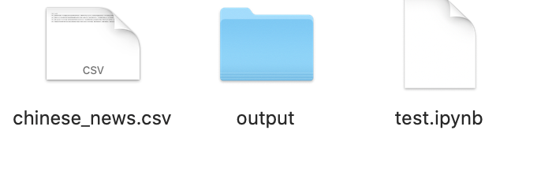
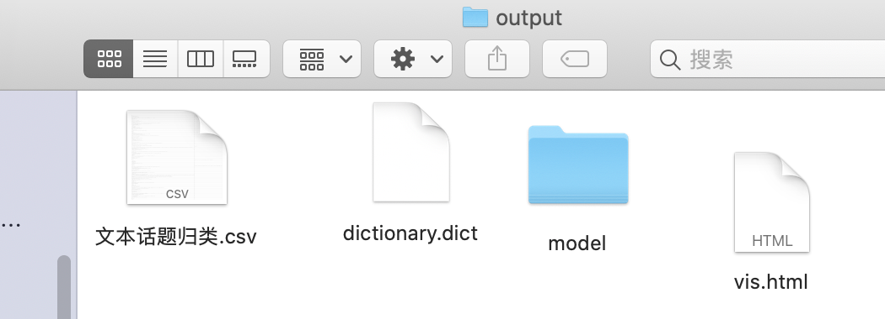

# cntopic
简单好用的lda话题模型，支持中英文。该库基于gensim，实现了lda话题模型。

# 安装


```python
pip install cntopic
```

# 使用
这里给大家引入一个场景，假设大家采集新闻数据，忘记采集新闻文本对应的新闻类别，如果人工标注又很费工夫。这时候我们可以用lda话题模型帮我们洞察数据中的规律，发现新闻有n种话题群体。这样lda模型对数据自动打标注topic_1, topic_2, topic_3... ,topic_n。

我们研究者的工作量仅仅限于解读topic_1, topic_2, topic_3... ,topic_n分别是什么话题即可。

lda训练过程，大致分为
1. 读取文件
2. 准备数据
3. 训练lda模型
4. 使用lda模型
5. 存储与导入lda模型
# 1. 读取文件
这里我们用一个新闻数据,一共有10类，每类1000条数据，涵盖

'时尚', '财经', '科技', '教育', '家居', '体育', '时政', '游戏', '房产', '娱乐'


```python
import pandas as pd

df = pd.read_csv('chinese_news.csv')
df.head()
```


<div>
<style scoped>
    .dataframe tbody tr th:only-of-type {
        vertical-align: middle;
    }

    .dataframe tbody tr th {
        vertical-align: top;
    }
    
    .dataframe thead th {
        text-align: right;
    }
</style>
<table border="1" class="dataframe">
  <thead>
    <tr style="text-align: right;">
      <th></th>
      <th>label</th>
      <th>content</th>
    </tr>
  </thead>
  <tbody>
    <tr>
      <th>0</th>
      <td>体育</td>
      <td>鲍勃库西奖归谁属？ NCAA最强控卫是坎巴还是弗神新浪体育讯如今，本赛季的NCAA进入到了末...</td>
    </tr>
    <tr>
      <th>1</th>
      <td>体育</td>
      <td>麦基砍28+18+5却充满寂寞 纪录之夜他的痛阿联最懂新浪体育讯上天对每个人都是公平的，贾维...</td>
    </tr>
    <tr>
      <th>2</th>
      <td>体育</td>
      <td>黄蜂vs湖人首发：科比冲击七连胜 火箭两旧将登场新浪体育讯北京时间3月28日，NBA常规赛洛...</td>
    </tr>
    <tr>
      <th>3</th>
      <td>体育</td>
      <td>双面谢亚龙作秀终成做作 谁来为低劣行政能力埋单是谁任命了谢亚龙？谁放纵了谢亚龙？谁又该为谢亚...</td>
    </tr>
    <tr>
      <th>4</th>
      <td>体育</td>
      <td>兔年首战山西换帅后有虎胆 张学文用乔丹名言励志今晚客场挑战浙江稠州银行队，是山西汾酒男篮的兔...</td>
    </tr>
  </tbody>
</table>
</div>


label标签的分布情况


```python
df['label'].value_counts()
```


    家居    1000
    时尚    1000
    房产    1000
    时政    1000
    教育    1000
    游戏    1000
    财经    1000
    娱乐    1000
    体育    1000
    科技    1000
    Name: label, dtype: int64


# 2. 准备数据
一般准备数据包括:
1. 分词、数据清洗
2. 按照模块需求整理数据的格式


注意在scikit-learn中:
- 英文文本不需要分词，原封不动传入即可。
- 中文文本需要先分词，后整理为英文那样用空格间隔的字符串。形如”我 爱 中国“


```python
import jieba

def text2tokens(raw_text):
    #将文本raw_text分词后得到词语列表
    tokens = jieba.lcut(raw_text)
    #tokens = raw_text.lower().split(' ') #英文用空格分词即可
    tokens = [t for t in tokens if len(t)>1] #剔除单字
    return tokens

#对content列中所有的文本依次进行分词
documents = [text2tokens(txt) 
             for txt in df['content']]  

#显示前5个document
print(documents[:5])
```


    [['鲍勃', '库西', '奖归', 'NCAA', '最强', '控卫', '坎巴', '还是', '弗神', '新浪', '体育讯', '称赞', '得分', '能力', '毋庸置疑',...],
    ['球员', '大东', '赛区', '锦标赛', '全国', '锦标赛', '他场', '27.1', '6.1', '篮板', '5.1', '助攻',..],
    ['依旧', '如此', '给力', '疯狂', '表现', '开始', '这个', '赛季', '疯狂', '表现', '结束', '这个', '赛季', '我们', '全国', '锦标赛', '前进', '并且', '之前', '曾经', '连赢', '赢得', '大东', ...],
    ['赛区', '锦标赛', '冠军', '这些', '归功于', '坎巴', '沃克', '康涅狄格', '大学', '主教练', '吉姆', '卡洪', ...],
    ['称赞', '一名', '纯正', '控卫', '而且', '能为', '我们', '得分', '单场', '42', '有过', '单场', '17', '助攻', ...]]


# 3. 训练lda模型
现在开始正式使用cntopic模块，开启LDA话题模型分析。步骤包括


|Step|功能|代码|
|---|:---|:---|
|0|准备documents，已经在前面准备好了|-|
|1|初始化Topic类|topic = Topic(cwd=os.getcwd())|
|2|根据documents数据，构建词典空间|topic.create_dictionary(documents=documents)|
|3|构建语料(将文本转为文档-词频矩阵)|topic.create_corpus(documents=documents)|
|4|指定n_topics，构建LDA话题模型|topic.train_lda_model(n_topics)|

这里我们就按照n_topics=10构建lda话题模型，一般情况n_topics可能要实验多次，找到最佳的n_topics



运行过程中会在代码所在的文件夹内生成一个output文件夹，内部含有
- dictionary.dict 词典文件
- lda.model.xxx 多个lda模型文件，其中xxx是代指




上述代码耗时较长，请耐心等待程序运行完毕~


```python
import os
from cntopic import Topic

topic = Topic(cwd=os.getcwd()) #构建词典dictionary
topic.create_dictionary(documents=documents) #根据documents数据，构建词典空间
topic.create_corpus(documents=documents) #构建语料(将文本转为文档-词频矩阵)
topic.train_lda_model(n_topics=10) #指定n_topics，构建LDA话题模型
```


    <gensim.models.ldamulticore.LdaMulticore at 0x158da5090>


# 4. 使用LDA模型

上面的代码大概运行了5分钟，LDA模型已经训练好了。 

现在我们可以利用LDA做一些事情，包括

|Step|功能|代码|补充|
|---|:---|:---|:---|
|1|分词后的某文档|document = ['游戏', '体育']||
|2|预测document对应的话题|topic.get_document_topics(document)||
|3|显示每种话题与对应的特征词之间关系|topic.show_topics()||
|4|数据中不同话题分布情况|topic.topic_distribution(raw_documents)|raw_documents是列表或series，如本教程中的df['content']|
|5|可视化LDA话题模型（**功能不稳定**）|topic.visualize_lda()|可视化结果在output中查找vis.html文件，浏览器打开即可|

## 4.1 准备document
假设有一个文档 ``'游戏体育真有意思'`` 分词处理得到document


```python
document = jieba.lcut('游戏体育真有意思')
document
```


    ['游戏', '体育', '真', '有意思']


## 4.2 预测document对应的话题
我们使用topic模型，看看document对应的话题


```python
topic.get_document_topics(document)
```


    [(0, 0.02501536),
     (1, 0.025016038),
     (2, 0.28541195),
     (3, 0.025018401),
     (4, 0.025018891),
     (5, 0.025017735),
     (6, 0.51443774),
     (7, 0.02502284),
     (8, 0.025015472),
     (9, 0.025025582)]


我们的lda话题模型是按照n_topics=10训练的，限制调用topic预测某个document时，得到的结果是这10种话题及对应概率的元组列表。


从中可以看到概率最大的是 ``话题6``， 概率有0.51443774。


所以我们可以大致认为document是话题6

## 4.3 显示每种话题与对应的特征词之间关系
但是仅仅告诉每个文档是 ``话题n``，我们仍然不知道 ``话题n``代表的是什么，所以我们需要看看每种 ``话题n``对应的 ``特征词语``。


```python
topic.show_topics()
```


    [(0,
      '0.042*"基金" + 0.013*"市场" + 0.011*"投资" + 0.009*"公司" + 0.005*"上涨" + 0.004*"股票" + 0.004*"房地产" + 0.004*"指数" + 0.004*"房价" + 0.004*"2008"'),
     (1,
      '0.010*"中国" + 0.007*"移民" + 0.006*"项目" + 0.005*"发展" + 0.005*"表示" + 0.005*"经济" + 0.005*"政府" + 0.005*"土地" + 0.004*"政策" + 0.004*"问题"'),
     (2,
      '0.014*"比赛" + 0.009*"他们" + 0.008*"球队" + 0.007*"篮板" + 0.006*"我们" + 0.005*"球员" + 0.005*"季后赛" + 0.005*"时间" + 0.005*"热火" + 0.005*"赛季"'),
     (3,
      '0.013*"我们" + 0.013*"一个" + 0.009*"自己" + 0.009*"这个" + 0.007*"没有" + 0.007*"他们" + 0.006*"可以" + 0.006*"就是" + 0.006*"很多" + 0.006*"记者"'),
     (4,
      '0.020*"电影" + 0.010*"导演" + 0.009*"微博" + 0.008*"影片" + 0.006*"观众" + 0.006*"一个" + 0.005*"自己" + 0.005*"票房" + 0.004*"拍摄" + 0.004*"娱乐"'),
     (5,
      '0.018*"学生" + 0.015*"留学" + 0.008*"大学" + 0.008*"可以" + 0.006*"功能" + 0.006*"像素" + 0.006*"拍摄" + 0.006*"采用" + 0.005*"学校" + 0.005*"申请"'),
     (6,
      '0.007*"玩家" + 0.006*"封神" + 0.006*"手机" + 0.006*"online" + 0.006*"the" + 0.006*"游戏" + 0.005*"陈水扁" + 0.005*"活动" + 0.005*"to" + 0.005*"一个"'),
     (7,
      '0.009*"信息" + 0.009*"考试" + 0.009*"游戏" + 0.007*"工作" + 0.007*"手机" + 0.006*"四六级" + 0.006*"考生" + 0.005*"发展" + 0.004*"可以" + 0.004*"霸王"'),
     (8,
      '0.015*"我们" + 0.011*"企业" + 0.011*"产品" + 0.010*"市场" + 0.009*"家具" + 0.009*"品牌" + 0.008*"消费者" + 0.007*"行业" + 0.007*"中国" + 0.007*"一个"'),
     (9,
      '0.012*"游戏" + 0.011*"玩家" + 0.010*"可以" + 0.008*"搭配" + 0.008*"活动" + 0.006*"时尚" + 0.005*"OL" + 0.004*"获得" + 0.004*"任务" + 0.004*"手机"')]


根据上面的 ``话题n`` 与 ``特征词`` 大致可以解读每个 ``话题n`` 是什么内容的话题。

## 4.4 话题分布情况
现在我们想知道数据集中不同 ``话题n`` 的分布情况


```python
topic.topic_distribution(raw_documents=df['content'])
```


    9    1670
    1    1443
    0    1318
    5    1265
    4    1015
    2     970
    8     911
    3     865
    7     307
    6     236
    Name: topic, dtype: int64


我们的数据有10类，每类是1000条。而现在LDA话题模型单纯的根据文本的一些线索，按照n_topics=10给我们分出的效果还不错。

最完美的情况是每个 ``话题n`` 都是接近1000, 现在 ``话题9``太多， ``话题6、 话题7``太少。

不过我们也要注意到某些话题可能存在交集，容易分错，比如
- 财经、房产、时政
- 体育娱乐
- 财经、科技

等

综上，目前模型还算可以，表现还能接受。


# 五、存储与导入lda模型
lda话题模型训练特别慢，如果不保存训练好的模型，实际上是在浪费我们的生命和电脑计算力。

好消息是cntopic默认为大家存储模型，存储地址是output文件夹内，大家只需要知道如何导入模型即可。

这里需要导入的有两个模型，使用步骤

|步骤|模型|代码|作用|
|---|---|---|---|
|0|-|-|准备documents|
|1|-|topic = Topic(cwd=os.getcwd())|初始化|
|2|词典|topic.load_dictionary(dictpath='output/dictionary.dict')|直接导入词典，省略topic.create_dictionary()|
|3|-|topic.create_corpus(documents=documents)|构建语料(将文本转为文档-词频矩阵)|
|4|lda话题模型|topic.load_lda_model(modelpath='output/model/lda.model')|导入lda话题模型， 相当于省略topic.train_lda_model(n_topics)|

现在我们试一试, 为了与之前的区分，这里我们起名topic2


```python
topic2 = Topic(cwd=os.getcwd())
topic2.load_dictionary(dictpath='output/dictionary.dict')
topic2.create_corpus(documents=documents)
topic2.load_lda_model(modelpath='output/model/lda.model')
```

大家可以自己回去试一试第4部分``使用LDA模型``的相关功能


## 如果

如果您是经管人文社科专业背景，编程小白，面临海量文本数据采集和处理分析艰巨任务，个人建议学习[《python网络爬虫与文本数据分析》](https://ke.qq.com/course/482241?tuin=163164df)视频课。作为文科生，一样也是从两眼一抹黑开始，这门课程是用五年时间凝缩出来的。自认为讲的很通俗易懂o(*￣︶￣*)o，

- python入门
- 网络爬虫
- 数据读取
- 文本分析入门
- 机器学习与文本分析
- 文本分析在经管研究中的应用

感兴趣的童鞋不妨 戳一下[《python网络爬虫与文本数据分析》](https://ke.qq.com/course/482241?tuin=163164df)进来看看~


## 更多

- [B站:大邓和他的python](https://space.bilibili.com/122592901/channel/detail?cid=66008)

- 公众号：大邓和他的python

- [知乎专栏：数据科学家](https://zhuanlan.zhihu.com/dadeng)

    ​    

## 支持一下


